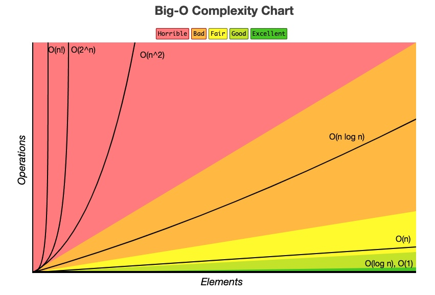

# Data Structures in 

Python implementations of common data structures such as LinkedList, Binary Search Trees, Queue, Stack, etc.

## Big-O Notation Cheat Sheet

## LinkedList

## Binary Search Tree

General coding exercises for fun.

## Anagram

## Duplicates in Array

## Palindrome

## Reverse Array

## Reverse Words in a Sentence

## References (Gotchas and Best Practices)
1 [Mutable Default Arguments](https://docs.python-guide.org/writing/gotchas/#mutable-default-arguments)